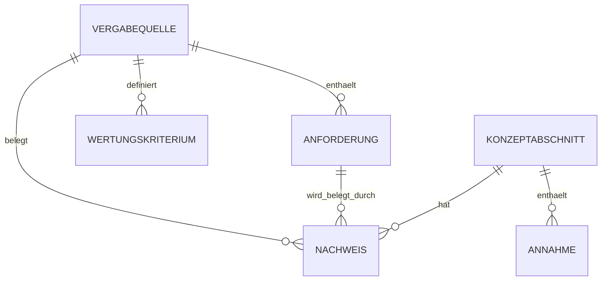

# Data Model: Angebotskonzept iBMS 3.0

## Entities

### 1. Vergabequelle
- Purpose: Repräsentiert ein offizielles Ausschreibungsdokument.
- Fields:
  - `id` (string, eindeutig)
  - `titel` (string, Pflicht)
  - `dateiname` (string, Pflicht)
  - `vergabenummer` (string, Pflicht)
  - `dokumenttyp` (enum: leistungsbeschreibung, funktionsbeschreibung, testumgebung, zahlungsplan, wertungshinweise)
  - `status` (enum: aktiv, ersetzt, unklar)
  - `verifiziert_am` (date, Pflicht)

### 2. Anforderung
- Purpose: Einzelne fachliche/organisatorische Vorgabe aus einer Vergabequelle.
- Fields:
  - `id` (string, eindeutig)
  - `titel` (string, Pflicht)
  - `beschreibung` (text, Pflicht)
  - `kategorie` (enum: funktional, compliance, testumgebung, meilenstein, wertung)
  - `prioritaet` (enum: hoch, mittel, niedrig)
  - `quelle_id` (fk -> Vergabequelle.id, Pflicht)
  - `status` (enum: offen, in_bearbeitung, abgedeckt, zur_pruefung)

### 3. Wertungskriterium
- Purpose: Bewertetes Kriterium inklusive Gewichtung und Erwartung.
- Fields:
  - `id` (string, eindeutig)
  - `name` (string, Pflicht)
  - `gewichtung_prozent` (number, Pflicht)
  - `unterkriterium` (string, optional)
  - `erwarteter_nachweis` (text, Pflicht)
  - `quelle_id` (fk -> Vergabequelle.id, Pflicht)

### 4. Konzeptabschnitt
- Purpose: Abschnitt im Dokument `Angebotskonzept.md`.
- Fields:
  - `id` (string, eindeutig)
  - `ueberschrift` (string, Pflicht)
  - `ziel` (text, Pflicht)
  - `inhalt` (markdown, Pflicht)
  - `status` (enum: entwurf, review, freigegeben)
  - `owner_rolle` (string, Pflicht)
  - `letzte_aenderung` (datetime, Pflicht)

### 5. Nachweis
- Purpose: Verbindet Konzeptaussagen mit Quellen und Anforderungen.
- Fields:
  - `id` (string, eindeutig)
  - `konzeptabschnitt_id` (fk -> Konzeptabschnitt.id, Pflicht)
  - `anforderung_id` (fk -> Anforderung.id, Pflicht)
  - `quelle_id` (fk -> Vergabequelle.id, Pflicht)
  - `nachweis_typ` (enum: direktes_zitat, paraphrase, ableitung)
  - `hinweis` (text, optional)

### 6. Annahme
- Purpose: Dokumentiert nicht abschliessend belegte Punkte.
- Fields:
  - `id` (string, eindeutig)
  - `beschreibung` (text, Pflicht)
  - `begruendung` (text, Pflicht)
  - `betroffener_abschnitt_id` (fk -> Konzeptabschnitt.id, Pflicht)
  - `validierungsbedarf` (text, Pflicht)
  - `status` (enum: offen, bestaetigt, verworfen)

## Relationships
- Eine `Vergabequelle` hat viele `Anforderung`.
- Eine `Vergabequelle` hat viele `Wertungskriterium`.
- Ein `Konzeptabschnitt` hat viele `Nachweis`.
- Eine `Anforderung` kann in vielen `Nachweis` referenziert werden.
- Eine `Vergabequelle` kann in vielen `Nachweis` referenziert werden.
- Ein `Konzeptabschnitt` kann viele `Annahme` enthalten.

## Entity Relationship Diagram

## Validation Rules
- Jede `Anforderung` muss mindestens eine gueltige `Vergabequelle` haben.
- Jeder freigegebene `Konzeptabschnitt` muss mindestens einen `Nachweis` haben.
- `gewichtung_prozent` muss im Bereich 0 bis 100 liegen.
- `verifiziert_am` darf nicht in der Zukunft liegen.
- `Annahme.status = offen` ist vor finaler Angebotsabgabe nicht zulaessig.

## State Transitions

### Konzeptabschnitt
- `entwurf -> review -> freigegeben`
- Ruecksprung erlaubt: `review -> entwurf` bei Gate-Fehler.

### Anforderung
- `offen -> in_bearbeitung -> abgedeckt -> zur_pruefung`
- Ruecksprung erlaubt: `zur_pruefung -> in_bearbeitung` bei Nachweisluecken.

### Annahme
- `offen -> bestaetigt` oder `offen -> verworfen`
