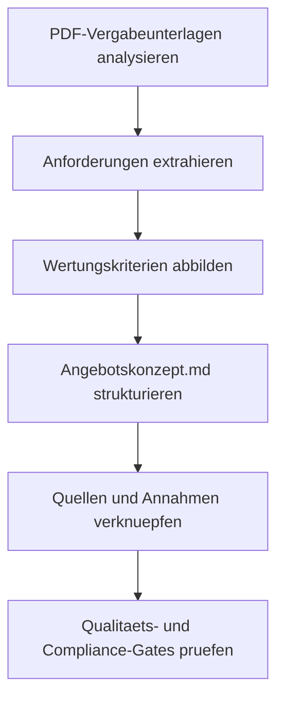

# Implementation Plan: Angebotskonzept iBMS 3.0

**Branch**: `[001-angebotskonzept-ibms]` | **Date**: 2026-07-01 | **Spec**: [spec.md](./spec.md)

**Input**: Feature specification from `/specs/001-angebotskonzept-ibms/spec.md`

**Note**: This template is filled in by the `/speckit.plan` command. See `.specify/templates/plan-template.md` for the execution workflow.

## Summary

Es wird ein deutsches, wertungsorientiertes Angebotskonzept (`Angebotskonzept.md`)
aus den PDF-Vergabeunterlagen erstellt. Der Ansatz kombiniert
quellengebundene Inhaltsaufbereitung, klare Annahmenkennzeichnung und
meilensteinorientierte Strukturierung entsprechend der Ausschreibungslogik.



## Technical Context

<!--
  ACTION REQUIRED: Replace the content in this section with the technical details
  for the project. The structure here is presented in advisory capacity to guide
  the iteration process.
-->

**Language/Version**: Markdown (CommonMark-kompatibel)

**Primary Dependencies**: PDF-Vergabeunterlagen in `documents/`, interne Speckit-Artefakte

**Storage**: Dateibasiert im Repository (`specs/001-angebotskonzept-ibms/`)

**Testing**: Dokumenten-Review gegen Contract-Checkliste und Quickstart-Validierung

**Target Platform**: Repository-basierte Angebotsbearbeitung (Linux/Editor-unabhaengig)

**Project Type**: Dokumentations-/Angebotsartefakt

**Performance Goals**: Vollstaendiger Erstentwurf in einem Iterationszyklus; 100 % Pflichtkapitelabdeckung

**Constraints**: Deutsche Sprache; XLSX-Quellen in dieser Iteration ausgeschlossen; Aussagen nur mit Quellenbezug oder Annahmekennzeichnung

**Scale/Scope**: 1 zentrales Angebotskonzept + 4 Planungsartefakte (research, data model, contract, quickstart)

## Constitution Check

*GATE: Must pass before Phase 0 research. Re-check after Phase 1 design.*

- **Outcome Alignment Gate**: Plan scope maps directly to tender submission
  outcomes; non-aligned work is excluded or justified.
- **Traceability Gate**: Every requirement and key decision references source
  evidence and verification date.
- **Compliance Gate**: Legal, confidentiality, and submission constraints are
  captured with clear controls.
- **Quality Gate Definition**: Pass/fail criteria and owners are defined for
  accuracy, completeness, compliance, and approvals.
- **Reproducibility Gate**: Build/package flow is documented so output can be
  recreated from known inputs.

**Gate Status (Pre-Research)**
- Outcome Alignment Gate: PASS (direkter Fokus auf Ausschreibungsangebot)
- Traceability Gate: PASS (Quellen-/Nachweisentitaeten und Contract-Regeln definiert)
- Compliance Gate: PASS (Compliance/Vertraulichkeit als Anforderungen aufgenommen)
- Quality Gate Definition: PASS (Quickstart + Contract-Akzeptanzcheck vorhanden)
- Reproducibility Gate: PASS (dateibasierter, nachvollziehbarer Workflow)

## Project Structure

### Documentation (this feature)

```text
specs/001-angebotskonzept-ibms/
├── plan.md              # This file (/speckit.plan command output)
├── research.md          # Phase 0 output (/speckit.plan command)
├── data-model.md        # Phase 1 output (/speckit.plan command)
├── quickstart.md        # Phase 1 output (/speckit.plan command)
├── contracts/           # Phase 1 output (/speckit.plan command)
└── tasks.md             # Phase 2 output (/speckit.tasks command - NOT created by /speckit.plan)
```

### Source Code (repository root)

```text
documents/
specs/
└── 001-angebotskonzept-ibms/
    ├── spec.md
    ├── plan.md
    ├── research.md
    ├── data-model.md
    ├── quickstart.md
    └── contracts/
        └── angebotskonzept-contract.md
```

**Structure Decision**: Dokumentengetriebene Struktur ohne Applikationscode; Fokus auf nachvollziehbare Angebotsartefakte im Feature-Ordner.

## Phase 0 Output

- `research.md` erstellt und alle Planungsunklarheiten aufgeloest.

## Phase 1 Output

- `data-model.md` erstellt.
- `contracts/angebotskonzept-contract.md` erstellt.
- `quickstart.md` erstellt.
- Agent-Context-Update-Script: Nicht vorhanden in `.specify/scripts/bash/`; daher in dieser Repository-Konfiguration nicht anwendbar.

## Post-Design Constitution Check

- Outcome Alignment Gate: PASS
- Traceability Gate: PASS
- Compliance Gate: PASS
- Quality Gate Definition: PASS
- Reproducibility Gate: PASS

## Complexity Tracking

> **Fill ONLY if Constitution Check has violations that must be justified**

Keine Verfassungsverletzungen; Tabelle nicht erforderlich.
