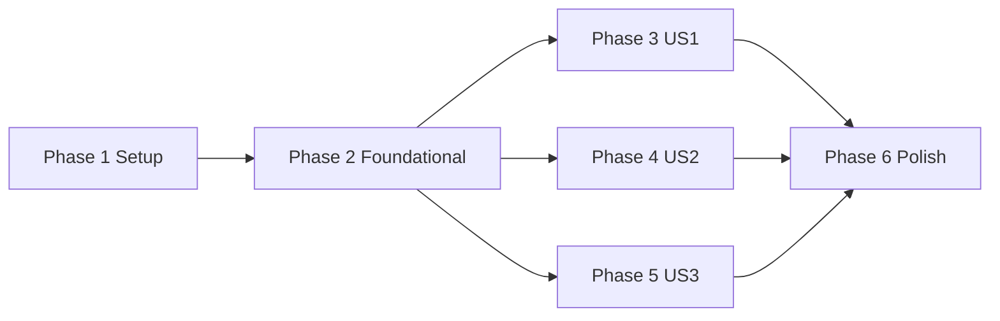

# Tasks: Angebotskonzept iBMS 3.0

**Input**: Design documents from `/specs/001-angebotskonzept-ibms/`

**Prerequisites**: plan.md (required), spec.md (required for user stories), research.md, data-model.md, contracts/

**Tests**: Keine separaten Test-Tasks eingeplant, da im Spec kein expliziter TDD- oder Testfall-Artefaktauftrag gefordert ist.

**Organization**: Tasks are grouped by user story to enable independent implementation and testing of each story.

## Phase 1: Setup (Shared Infrastructure)

**Purpose**: Arbeitsbasis, Dateistruktur und Referenzartefakte fuer die Angebotserstellung initialisieren.

- [X] T001 Erstelle die Zieldatei fuer den Konzeptentwurf in specs/001-angebotskonzept-ibms/Angebotskonzept.md
- [X] T002 Erstelle die Quellenliste mit Vergabequellen-Metadaten in specs/001-angebotskonzept-ibms/evidence/quellenverzeichnis.md
- [X] T003 [P] Erstelle die initiale Kapitel-zu-Quellen-Matrix in specs/001-angebotskonzept-ibms/evidence/kapitel-quellen-matrix.md
- [X] T004 [P] Erstelle die Annahmenliste mit Validierungsfeldern in specs/001-angebotskonzept-ibms/evidence/annahmenregister.md

---

## Phase 2: Foundational (Blocking Prerequisites)

**Purpose**: Verbindliche Regeln fuer Nachweisbarkeit, Compliance, Qualitaetsgates und Reproduzierbarkeit definieren.

**⚠️ CRITICAL**: No user story work can begin until this phase is complete.

- [X] T005 Definiere die Pflichtkapitelstruktur gemaess Contract in specs/001-angebotskonzept-ibms/Angebotskonzept.md
- [X] T006 Definiere den Nachweisstandard (Zitat/Paraphrase/Ableitung + Verifiziert-am) in specs/001-angebotskonzept-ibms/evidence/nachweisstandard.md
- [X] T007 [P] Definiere die Konfliktlogik fuer widerspruechliche Vergabequellen in specs/001-angebotskonzept-ibms/evidence/konfliktprotokoll.md
- [X] T008 [P] Definiere Vertraulichkeits- und Datenklassifizierungsregeln in specs/001-angebotskonzept-ibms/checklists/confidentiality.md
- [X] T009 Definiere Qualitaetsgates mit Ownern und Pass/Fail-Kriterien in specs/001-angebotskonzept-ibms/checklists/submission-gates.md
- [X] T010 Definiere reproduzierbare Build- und Review-Schritte in specs/001-angebotskonzept-ibms/checklists/reproducibility.md
- [X] T032 Definiere Aufbewahrungs- und Loeschregeln fuer Tender-Artefakte in specs/001-angebotskonzept-ibms/checklists/retention-policy.md
- [X] T033 [P] Definiere zugelassene Quellenhierarchie und External-Source-Whitelist in specs/001-angebotskonzept-ibms/evidence/source-policy.md

**Checkpoint**: Foundation ready - user story implementation can now begin.

---

## Phase 3: User Story 1 - Angebotskonzept erzeugen (Priority: P1) 🎯 MVP

**Goal**: Ein vollstaendiges, deutsches Angebotskonzept mit allen Pflichtkapiteln und nachvollziehbaren Quellenbezuegen erstellen.

**Independent Test**: Aus den Vergabeunterlagen entsteht eine Datei specs/001-angebotskonzept-ibms/Angebotskonzept.md mit allen Pflichtkapiteln, Quellenbezug pro Schluesselaussage und markierten Annahmen.

### Implementation for User Story 1

- [X] T011 [US1] Erstelle die Abschnitte 1-3 (Einleitung, Ausgangslage, fachliches Loesungskonzept) in specs/001-angebotskonzept-ibms/Angebotskonzept.md
- [X] T012 [US1] Erstelle die Abschnitte 4-6 (Rollen/Rechte, Test-/Abnahmeumgebung, Meilensteinlogik) in specs/001-angebotskonzept-ibms/Angebotskonzept.md
- [X] T013 [US1] Erstelle die Abschnitte 10-11 (Risikobetrachtung/Annahmen, Nachweis-/Quellenuebersicht) in specs/001-angebotskonzept-ibms/Angebotskonzept.md
- [X] T014 [P] [US1] Trage Quellenreferenzen fuer zentrale Aussagen in specs/001-angebotskonzept-ibms/evidence/kapitel-quellen-matrix.md ein
- [X] T015 [P] [US1] Trage alle unbelegten Punkte als Annahmen mit Validierungsbedarf in specs/001-angebotskonzept-ibms/evidence/annahmenregister.md ein
- [X] T016 [US1] Verknuepfe Aussagen aus Abschnitten 3, 5 und 6 mit Nachweis-Typen in specs/001-angebotskonzept-ibms/evidence/nachweise.md
- [X] T017 [US1] Fuehre die Sprach- und Strukturpruefung (Deutsch/Markdown) fuer Erstentwurf durch in specs/001-angebotskonzept-ibms/checklists/quality-review.md
- [X] T018 [US1] Aktualisiere den Erstentwurf nach Review-Befunden in specs/001-angebotskonzept-ibms/Angebotskonzept.md

**Checkpoint**: User Story 1 ist vollstaendig und als MVP separat pruefbar.

---

## Phase 4: User Story 2 - Wertungsorientierte Ausarbeitung (Priority: P2)

**Goal**: Die wertungsrelevanten Unterkriterien explizit, nachvollziehbar und abschnittsscharf im Konzept abbilden.

**Independent Test**: Jeder Wertungsblock besitzt mindestens ein eigenes Unterkapitel in specs/001-angebotskonzept-ibms/Angebotskonzept.md mit klarem Beitrag zur Wertung und Quellenbezug.

### Implementation for User Story 2

- [X] T019 [US2] Erstelle Abschnitt 7 (Organisations- und Kommunikationsansatz) wertungsorientiert in specs/001-angebotskonzept-ibms/Angebotskonzept.md
- [X] T020 [US2] Erstelle Abschnitt 8 (Personal- und Qualitaetssicherungskonzept) wertungsorientiert in specs/001-angebotskonzept-ibms/Angebotskonzept.md
- [X] T021 [US2] Erstelle Abschnitt 9 (Service-Delivery und Beschwerdemanagement) wertungsorientiert in specs/001-angebotskonzept-ibms/Angebotskonzept.md
- [X] T022 [P] [US2] Aktualisiere die Mapping-Tabelle Wertungskriterium-zu-Konzeptabschnitt in specs/001-angebotskonzept-ibms/evidence/wertungsmatrix-mapping.md
- [X] T023 [US2] Fuehre Konsistenzpruefung gegen Leistungsbeschreibung und Wertungshinweise durch in specs/001-angebotskonzept-ibms/checklists/wertung-review.md
- [X] T034 [US2] Berechne SC-002-Abdeckungsquote ueber kritische Anforderungen in specs/001-angebotskonzept-ibms/evidence/requirements-coverage.md

**Checkpoint**: User Stories 1 und 2 sind jeweils eigenstaendig nachvollziehbar und pruefbar.

---

## Phase 5: User Story 3 - Teamfaehige Weiterbearbeitung (Priority: P3)

**Goal**: Das Konzept fuer kollaborative Weiterbearbeitung mit stabiler Struktur, klaren Ownern und reproduzierbaren Reviewablaeufen vorbereiten.

**Independent Test**: Mehrere Bearbeitende koennen unterschiedliche Abschnitte parallel aktualisieren, ohne Struktur- oder Nachweisverluste.

### Implementation for User Story 3

- [X] T024 [P] [US3] Definiere Abschnitts-Owner und Review-Rollen in specs/001-angebotskonzept-ibms/collaboration/section-owners.md
- [X] T025 [US3] Definiere Redaktionsregeln fuer Abschnittsaenderungen und Nachweisaktualisierungen in specs/001-angebotskonzept-ibms/collaboration/editing-guidelines.md
- [X] T026 [US3] Definiere Freigabe-Workflow mit Review-Status pro Abschnitt in specs/001-angebotskonzept-ibms/collaboration/review-workflow.md
- [X] T027 [US3] Fasse offene Punkte, To-dos und Annahmen-Validierungen fuer Teamrunde zusammen in specs/001-angebotskonzept-ibms/collaboration/review-backlog.md

**Checkpoint**: Alle drei User Stories sind unabhaengig nutzbar und teamfaehig.

---

## Phase 6: Polish & Cross-Cutting Concerns

**Purpose**: Feature-uebergreifende Endabnahme, Nachvollziehbarkeit und Abgabereife sicherstellen.

- [X] T028 Fuelle die finale Contract-Acceptance-Checklist fuer specs/001-angebotskonzept-ibms/Angebotskonzept.md in specs/001-angebotskonzept-ibms/contracts/angebotskonzept-contract.md
- [X] T029 [P] Fuehre die Quickstart-Validierung End-to-End durch und dokumentiere Ergebnisse in specs/001-angebotskonzept-ibms/quickstart-validation.md
- [X] T030 Erstelle das finale Abgabe-Manifest mit Artefaktliste und Aenderungsprotokoll in specs/001-angebotskonzept-ibms/submission/package-manifest.md
- [X] T031 Fuehre finalen Constitution-Compliance-Check mit Nachweislinks durch in specs/001-angebotskonzept-ibms/checklists/constitution-review.md
- [X] T035 Validiere, dass keine unzulaessigen externen Quellen als verbindlich verwendet wurden, in specs/001-angebotskonzept-ibms/checklists/source-compliance.md
- [X] T036 [P] Validiere FR-010-Verwendbarkeit fuer Folgeunterlagen in specs/001-angebotskonzept-ibms/checklists/downstream-readiness.md
- [X] T037 Dokumentiere Start/Ende und Ergebnisnachweis der ersten Review-Runde fuer SC-005 in specs/001-angebotskonzept-ibms/checklists/review-timing.md

---

## Dependencies & Execution Order

### Phase Dependencies

- **Setup (Phase 1)**: No dependencies - can start immediately.
- **Foundational (Phase 2)**: Depends on Setup completion - BLOCKS all user stories.
- **User Stories (Phase 3+)**: All depend on Foundational phase completion.
- **Polish (Phase 6)**: Depends on completion of all selected user stories.

### User Story Dependencies

- **US1 (P1)**: Startet direkt nach Phase 2; keine Abhaengigkeit auf andere Stories.
- **US2 (P2)**: Startet nach Phase 2; nutzt Artefakte aus US1 fuer inhaltliche Erweiterung, bleibt aber eigenstaendig pruefbar.
- **US3 (P3)**: Startet nach Phase 2; kann parallel laufen, entfaltet vollen Nutzen mit vorhandenen Inhalten aus US1/US2.

### Dependency Graph



### Within Each User Story

- Kapitel-/Strukturaufbau vor finaler Konsolidierung.
- Nachweis- und Annahmenpflege vor Story-Abnahme.
- Story-Review vor Uebergang in naechste Prioritaet.

## Parallel Opportunities

- Setup parallel: T003 und T004
- Foundational parallel: T007 und T008
- US1 parallel: T014 und T015
- US2 parallel: T022 parallel zu Kapitelarbeit T019-T021
- US3 parallel: T024 parallel zu inhaltlichen Redaktionsregeln T025-T027
- Polish parallel: T029 parallel zu T028/T030
- Foundational parallel (erweitert): T033 parallel zu T007/T008
- US2 parallel (erweitert): T034 nach Kapitelerstellung parallel zu Review-Task T023
- Polish parallel (erweitert): T036 parallel zu T029

## Parallel Example: User Story 1

```bash
# Parallel nach Kapitel-Erstaufbau:
Task: "T014 [US1] Quellenreferenzen in specs/001-angebotskonzept-ibms/evidence/kapitel-quellen-matrix.md"
Task: "T015 [US1] Annahmenregister in specs/001-angebotskonzept-ibms/evidence/annahmenregister.md"
```

## Implementation Strategy

### MVP First (User Story 1 Only)

1. Phase 1 abschliessen
2. Phase 2 abschliessen (blockierend)
3. Phase 3 (US1) komplett abschliessen
4. US1 unabhaengig anhand des Independent Tests validieren
5. Erst danach mit US2/US3 erweitern

### Incremental Delivery

1. Setup + Foundational liefern die Governance- und Nachweisbasis.
2. US1 liefert den einreichbaren Kernentwurf.
3. US2 steigert die Wertungswirksamkeit.
4. US3 macht das Artefakt teamfaehig fuer Review/Freigabe.
5. Polish sichert Abgabereife und Reproduzierbarkeit.

### Parallel Team Strategy

1. Team erstellt gemeinsam Setup + Foundational.
2. Danach:
   - Bearbeiter A: US1 Kernkapitel und Nachweise
   - Bearbeiter B: US2 Wertungskapitel und Mapping
   - Bearbeiter C: US3 Kollaborations- und Review-Workflow
3. Gemeinsame Endabnahme in Phase 6.

## Notes

- [P] tasks = different files, no dependencies.
- [USx] labels map tasks to user stories for traceability.
- Jede Story bleibt separat pruefbar.
- Commit nach jedem Task oder logischem Task-Block.
